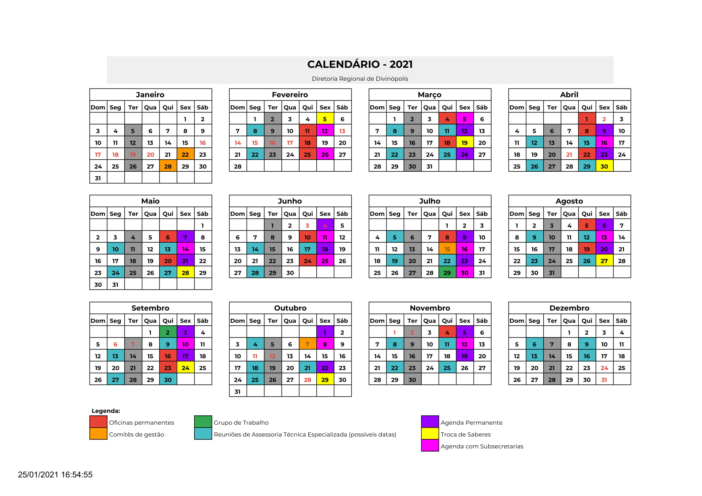

**Data - Atividade - Assunto - Título da atividade**

---

### Janeiro
**22/1/2021** - Comitê de Gestão - Apresentação Geral - Apresentação Geral da Diretoria Regional da SEDESE

 **28/1/2021** - Comitê de Gestão - Nivelamento básico (SUAS) - Estrutura do SUAS: principais legislações, princípios, diretrizes, panorama geral, financiamento
  **Apresentações:** [PARTE 1](https://docs.google.com/presentation/d/1tJDgu8AH3Zvv1YvX8-cP6lEJobAuxFNypx4k7EPGmec/edit#slide=id.p) I [PARTE 2](https://drive.google.com/file/d/1OztslnXcmNrQ8fLdxD23mD-LP4rPSKtH/view?usp=sharing)

---

### Fevereiro
**11/2/2021** - Oficina Permanente - Nivelamento básico (SUAS) - Benefícios: Benefício de Prestação Continuada, Programa Bolsa Família e Benefícios Eventuais
  **Apresentações:** [Material de apresentação](https://drive.google.com/file/d/14vOYl5Wr9xgxVsFvXjZrMoGiysrQh1-5/view?usp=sharing)

 **18/2/2021** - Oficina Permanente - Nivelamento básico (SUAS) - Serviços da Assistência Social 1: Proteção Social Básica

 **25/2/2021** - Oficina Permanente - Nivelamento básico (SUAS) - Serviços da Assistência Social 2: A Média Complexidade

---

### Março
**4/3/2021** - Oficina Permanente - Nivelamento básico (SUAS) - Serviços da Assistência Social 3: A Alta Complexidade

 **17/3/2021** - Comitê de Gestão - Evento intersetorial - Entendendo as políticas públicas de habitação no Brasil

 **18/3/2021** - Oficina Permanente - Nivelamento básico (SUAS) - Gestão Financeira e Orçamentária no SUAS

---

### Abril
**1/4/2021** - Oficina Permanente - Nivelamento básico (SUAS) - Marco Regulatório das Organizações da Sociedade Civil

 **8/4/2021** - Oficina Permanente - Nivelamento básico (SUAS) - Conselho Municipal de Assistência Social: atribuições, lei de criação, regimento interno, eleição, secretária executiva, exercício do controle social (planos, orçamento, PBF e entidades

 **22/4/2021** - Oficina Permanente - Violência contra crianças e adolescentes - Direitos das crianças e adolescentes (breve histórico, conceito, contexto atual baseado em dados, tipos de violações a esses direitos, onde denunciar, legislações pertinentes)

---

### Maio
 **6/5/2021** - Oficina Permanente - Violência contra crianças e adolescentes - Conselho Tutelar: Parte 1 (Papel e competências do Conselho Tutelar)

 **20/5/2021** - Oficina Permanente - Violência contra crianças e adolescentes - Conselho Tutelar e Políticas Públicas: Parte 2 (Rotina de intervenção do Conselheiro Tutelar, relacionamento com Sistema de Garantia de Direitos e CMDCA )

---

### Junho
**10/6/2021** - Oficina Permanente - Violência contra crianças e adolescentes - Como desenhar uma estratégia de garantia de direitos às crianças e adolescentes por meio do FIA?

 **24/6/2021** - Oficina Permanente - Violência contra crianças e adolescentes - Atendimento a famílias com crianças e adolescentes vítimas de violência na Proteção Social Básica (PAIF e SCFV)

---

### Julho
**8/7/2021** - Oficina Permanente - Violência contra crianças e adolescentes - Atendimento a famílias com crianças e adolescentes vítimas de abuso sexual no PAEFI: Escuta Especializada

 **15/7/2021** - Comitê de Gestão - Violência contra crianças e adolescentes - Atendimento às crianças e adolescentes na alta complexidade e relacionamento com sistema judicial: Acolhimento Institucional e Família Acolhedora

 **29/7/2021** - Grupo de Trabalho - Violência contra crianças e adolescentes - Desenhando protocolos de atendimento à violência contra crianças e adolescentes

---

### Agosto
**5/8/2021** - Oficina Permanente - Violência contra a mulher - Compreendendo o fenômeno da violência contra a mulher: desigualdades de gênero, tipificação das violações e redes de proteção.

 **19/8/2021** - Oficina Permanente - Violência contra a mulher - Prevenção à violência contra a mulher na PSB: possibilidades de interveção no PAIF e SCFV.

---

### Setembro
**2/9/2021** - Grupo de Trabalho - Violência contra a mulher - Grupos com Mulheres Vítimas de Violência: desafios e possibilidades

 **16/9/2021** - Oficina Permanente - Violência contra a mulher - implementando o Conselho Municipal dos Direitos das Mulheres

 **23/9/2021** - Oficina Permanente - Violência contra a mulher - Atendimento às Mulheres Vítimas de Violência na PSE: possiblidades de intervenção no PAEFI

---

### Outubro
**7/10/2021** - Comitê de Gestão - Violência contra a mulher - Construindo redes de enfrentamento à violência no município

---

### Novembro
**4/11/2021** - Oficina Permanente - Segurança Alimentar e Nutricional - As interfaces da Política de Segurança Alimentar e Nutricional com as cinco seguranças socioassistenciais

---

### Dezembro

